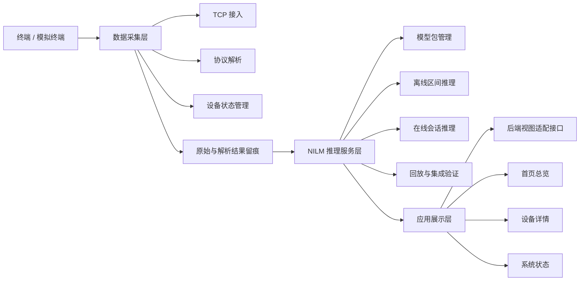
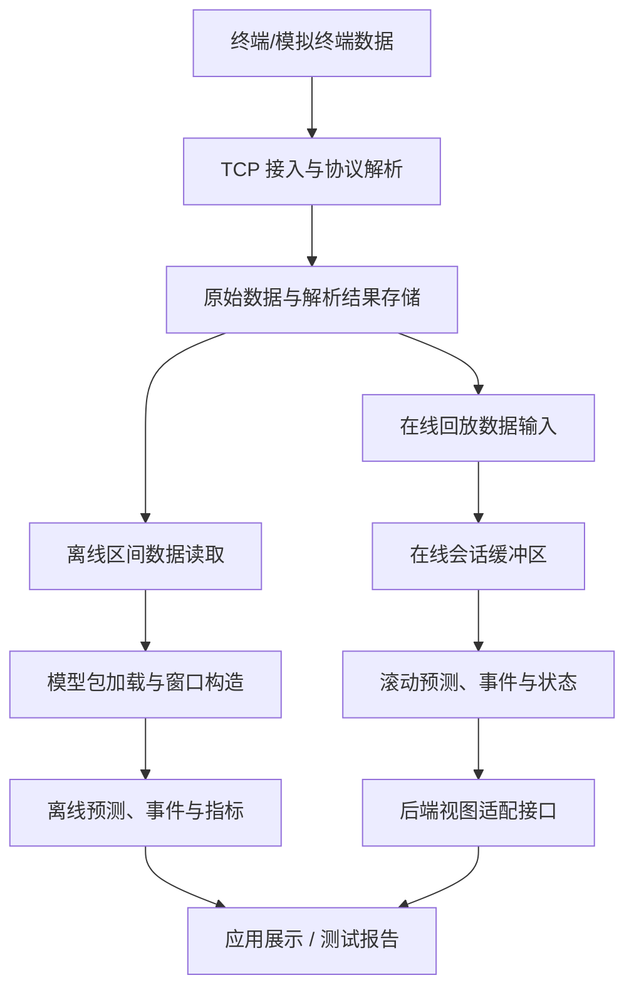

# 面向家庭能耗场景的 NILM 在线监测与推理系统设计与实现

# 第1章 绪论

## 1.1 研究背景与意义

随着居民生活水平提高和智能家居设备普及，家庭用电设备的数量、类型和运行模式不断增加。传统家庭用电管理通常只能从电表或账单中获得总电量、总功率等汇总信息，难以进一步判断不同设备的运行状态、能耗构成和异常用电行为。对于家庭节能管理、用电行为分析和设备运行状态监测而言，仅有总量信息是不够的。用户需要了解“哪些设备正在用电”“主要耗电来自哪里”“设备启停是否异常”等更细粒度的信息，系统也需要具备从原始用电数据到设备级结果展示的完整处理能力。

非侵入式负荷监测（Non-Intrusive Load Monitoring，NILM）为上述问题提供了一种低侵入的技术思路。NILM 通常在家庭总进线或总电表处采集电压、电流、功率等电气量数据，通过信号处理或机器学习方法从总负荷序列中推断单个或多个用电设备的功率消耗、开关状态和运行事件[1]。与为每个设备单独安装计量装置的侵入式监测方式相比，NILM 具有安装改造少、维护成本低、对用户环境影响小等特点，更适合家庭和小型建筑等场景中的用电监测应用[2]。

现有 NILM 研究已经在事件检测、负荷分解、深度学习模型和公开数据集评估等方面形成了较多成果。事件检测研究为从总负荷信号中定位设备启停和负荷变化提供了基础[6]。负荷特征研究从稳态功率、谐波、电压电流轨迹等角度总结了设备可区分特征的构成方式[5]。深度学习研究进一步推动了 NILM 从人工特征和显式状态建模向数据驱动建模发展[8]。序列到点学习则是深度学习 NILM 中具有代表性的建模方式之一[9]。公开数据集为不同算法之间的复现实验提供了基础数据条件[10]，开源工具链则为数据集解析、算法比较和评价指标计算提供了统一实现基础[11]。这些研究为 NILM 技术提供了重要算法基础。但从工程系统实现角度看，一个可运行、可演示、可测试的 NILM 系统不仅需要模型本身，还需要完成数据采集、协议解析、数据留痕、模型工件管理、服务化推理、在线回放、结果展示和系统测试等环节[4]。如果这些环节之间缺少清晰边界和可验证接口，模型即使在离线数据上取得较好结果，也难以形成稳定的在线监测系统。

因此，本文不将研究重点放在提出新的 NILM 算法上，而是面向家庭能耗场景，设计并实现一个 NILM 在线监测与推理系统。系统围绕数据采集层、NILM 推理服务层和应用展示层展开：数据采集层负责终端接入、协议解析和数据留痕；NILM 推理服务层负责模型包加载、离线区间推理、在线会话推理和回放验证；应用展示层通过稳定视图接口消费推理结果，展示家庭用电状态、设备功率和运行事件。通过这种组织方式，本文将 NILM 模型能力纳入可运行的软件系统中，形成从数据输入到结果展示的工程闭环。

本文工作的意义主要体现在三个方面。第一，在应用层面，系统能够为家庭能耗精细化分析提供设备级信息，使用户不再只能看到总用电量，而可以进一步观察设备运行状态和主要耗电来源。第二，在工程层面，系统将通信采集、模型推理、接口封装和页面展示组合为可测试的链路，避免 NILM 工作停留在单一模型验证阶段。第三，在毕业设计实践层面，本文覆盖通信、数据处理、后端服务、模型推理、前端展示和系统测试等多个环节，有助于体现系统设计与实现类课题的完整性和实际开发能力。

## 1.2 国内外研究现状

NILM 的基本思想最早由 Hart 提出，其目标是在不为每个设备单独安装传感器的情况下，通过总负荷信号推断用电设备的运行状态[1]。早期 NILM 方法主要依赖功率阶跃、稳态功率、设备启停事件等人工特征[1]。负荷签名研究进一步从稳态功率、谐波、电压电流轨迹等角度总结了设备可区分特征的构成方式[5]。此类方法计算量较小、可解释性较强，在设备功率特征明显、同时运行设备较少的场景下具有一定效果。但在真实家庭环境中，多设备同时运行、设备功率相近、噪声干扰、采样缺失等因素会增加负荷分解难度[3]。

随着机器学习和深度学习的发展，研究者开始使用隐马尔可夫模型、卷积神经网络、循环神经网络、序列到序列和序列到点等方法处理 NILM 任务。隐马尔可夫模型及其扩展形式可以将负荷分解问题转化为设备状态序列的概率推断问题[7]。深度学习方法能够从历史负荷序列中学习设备运行模式，减少对手工特征的依赖[8]。序列到点学习方法进一步将滑动窗口内的总功率序列映射到目标时刻的设备功率估计，在公开数据集上取得了较有代表性的结果[9]。相关研究通常使用 MAE、RMSE、Precision、Recall、F1 等指标评价功率预测误差和事件识别效果[11]。算法研究推动了 NILM 识别能力提升，也为本文推理服务中的模型输出、误差评价和事件分析提供了技术基础。

除模型算法外，NILM 系统的工程化部署也逐渐受到关注。真实部署研究指出，NILM 从算法验证走向应用系统时，需要同时处理数据采集、模型训练、系统部署、计算资源和服务延迟等问题[4]。部分研究将负荷识别模型部署到嵌入式设备或边缘计算节点，关注实时性、算力约束和模型压缩[13]。也有研究基于物联网或云平台构建在线监测系统，将数据采集、云端处理、用户展示和远程管理结合起来[12]。这类工作说明 NILM 的实际价值不仅取决于算法指标，还取决于数据链路是否稳定、模型接口是否清晰、在线推理是否可持续运行以及结果是否能够被用户或上层系统理解。

综合来看，现有研究在算法模型和数据集评估方面较为充分，但在本科毕业设计系统实现语境下仍存在几个需要处理的问题。第一，部分研究重模型轻系统，对采集链路、协议解析、异常数据处理和运行状态观测讨论不足。第二，部分在线系统虽然包含展示页面，但模型服务、数据接口和展示层之间的边界不够明确，后续替换模型或扩展页面时容易产生耦合[12]。第三，离线实验结果和在线运行效果之间存在差异，系统需要通过回放、接口检查和端到端测试证明推理链路实际可用[4]。

针对这些问题，本文以“系统设计与实现”为主线，将 NILM 模型能力放入一个可运行的在线监测与推理系统中。本文关注的重点不是单一算法创新，而是如何组织采集数据、模型包、推理 API、在线会话、应用视图和测试验证，使系统能够从工程角度支撑家庭能耗场景中的设备级用电展示。

## 1.3 研究内容与技术路线

本文围绕“面向家庭能耗场景的 NILM 在线监测与推理系统设计与实现”展开，研究内容包括以下几个方面。

第一，设计数据采集与协议解析模块，并在后续实现章节中说明其实现过程。该模块负责接收终端或模拟终端上报的电气量数据，完成 TCP 连接管理、协议报文解析、设备状态维护和数据持久化。采集层需要保留原始报文和解析结果，使后续推理、测试和问题定位具有可追溯依据。

第二，设计 NILM 推理服务模块，并围绕模型包、推理接口和在线会话机制组织系统实现。该模块负责将训练得到的 NILM 模型组织为可部署模型包，通过模型元数据、归一化参数、后处理规则和接口说明约束模型运行环境。推理服务需要提供离线区间推理和在线会话推理能力，使模型结果能够以服务接口形式被测试脚本和应用展示层调用。

第三，设计在线回放与集成验证链路。由于真实家庭用电数据流难以在每次演示中稳定复现，系统通过回放模块模拟持续输入，将历史数据按设定速度发送至推理服务。在线会话根据滚动窗口持续输出预测结果和事件信息，从而验证系统在连续数据输入场景下的运行能力。

第四，设计应用展示层及后端视图适配接口。应用展示层不直接处理原始协议和模型训练过程，而是通过后端视图适配接口消费推理服务结果。本文基础实现范围限定为家庭用电首页、设备详情、系统状态和基础模拟控制，重点展示当前功率、设备状态、事件信息、模型状态和数据可用性，不将多用户权限、完整历史报表等规划能力作为本文主体贡献。

第五，完成系统测试与结果分析。本文将围绕采集模块、推理服务、模型指标、在线回放和端到端展示开展测试，记录测试输入、测试步骤、预期结果和实际结果，并分析系统可用性、误差来源和后续改进方向。

本文技术路线如图 1-1 所示。系统首先从家庭能耗监测需求出发，明确数据接入、推理服务和结果展示边界；随后设计三层总体架构和层间接口；再分别推进数据采集、模型推理、在线回放和应用展示模块；最后通过接口测试、回放验证和端到端运行结果说明系统有效性。

图 1-1 技术路线示意图

## 1.4 本文主要工作

本文主要工作如下。

（1）设计了面向家庭能耗场景的 NILM 在线监测与推理系统总体架构。系统划分为数据采集层、NILM 推理服务层和应用展示层，明确各层输入输出、职责边界和数据流关系，为后续模块实现提供整体依据。

（2）围绕数据采集与协议解析模块开展设计与实现。该模块基于 TCP 连接接收终端数据，解析固定协议报文，维护设备在线状态和异常信息，并通过原始数据与结构化结果留痕支撑后续推理和测试。

（3）设计 NILM 推理服务与模型工件管理机制。系统通过模型包约定模型文件、元数据、归一化参数、后处理规则和接口版本，提供离线推理、在线会话、回放输入和推理结果输出能力，使模型能够作为可调用服务接入系统。

（4）设计应用展示层的基础功能范围与端到端验证路径。应用展示层通过后端视图适配接口消费推理服务输出，提供首页总览、设备详情和系统状态等基础页面，并通过测试脚本和运行状态展示验证从数据输入到结果呈现的闭环。

## 1.5 论文组织结构

本文共分为七章。

第1章为绪论，介绍研究背景与意义、国内外研究现状、本文研究内容、技术路线和主要工作。

第2章为相关技术与需求分析，介绍 NILM 基本概念和本文实际使用的通信、数据处理、推理服务、在线回放和可视化技术，并分析系统功能需求和非功能需求。

第3章为系统总体设计，说明系统设计目标、总体架构、数据流、模块划分、关键数据接口、模型包契约以及技术经济与可行性分析。

第4章为数据采集与预处理模块设计实现，重点介绍 TCP 采集链路、协议解析、设备状态管理、异常处理和数据存储。

第5章为 NILM 推理服务模块设计实现，重点介绍数据处理流程、模型包管理、离线推理、在线会话推理、在线回放和集成验证。

第6章为系统应用界面与功能实现，介绍应用展示层功能定位、后端视图适配接口、首页总览、设备详情、系统状态和推理结果展示。

第7章为系统测试与结果分析，从采集模块、推理服务、模型指标、在线回放和端到端运行等角度验证系统功能，并分析测试结果和不足。

# 第2章 相关技术与需求分析

## 2.1 非侵入式负荷监测技术概述

非侵入式负荷监测是一种通过总进线或总电表处电气量数据推断单个用电设备运行状态和能耗情况的技术[1]。其输入通常是按时间排列的总负荷数据，例如总有功功率序列、电压序列、电流序列或多个电气量组合特征；其输出可以是目标电器的功率估计值、设备开关状态、启停事件或能耗统计结果[3]。对于家庭能耗场景而言，NILM 的价值在于用较低部署成本获得设备级用电信息，为能耗分析和设备状态展示提供基础[2]。

NILM 任务一般包含负荷分解和事件检测两类目标。负荷分解关注在每个时间点估计目标设备功率，适合展示设备用电曲线和计算能耗占比[3]；事件检测关注设备启停变化，适合展示开关事件、运行片段和异常行为[6]。两类结果可以相互补充：功率序列能够提供连续变化趋势，事件结果能够提供更容易被用户理解的状态变化。

从方法角度看，NILM 可以使用基于事件检测、基于电气特征、基于概率模型和基于深度学习的方法。事件检测方法关注总功率突变，适合识别功率变化明显的设备[6]；电气特征方法利用功率因数、谐波、V-I 轨迹等特征提高区分能力[5]；概率模型方法将设备状态视为隐状态序列进行推断[7]；深度学习方法通过神经网络从历史负荷序列中学习设备运行模式[8]。本文不展开新的算法结构设计，而是在已有模型训练结果基础上，重点解决模型如何作为系统能力被加载、调用、验证和展示。

NILM 评价通常包括功率误差指标和事件指标。功率误差可使用 MAE、RMSE、MeanDiff、MaxAbsDiff 等指标衡量预测功率与真实功率之间的差异；事件识别可使用 Precision、Recall、F1 和事件时间偏差等指标衡量开关事件检测效果[11]。本文后续测试章节将结合离线区间推理和在线回放结果，说明系统推理链路和模型输出是否满足演示与分析需要。

## 2.2 系统关键技术

本文系统涉及的关键技术不是孤立技术堆叠，而是围绕“数据进入系统、模型完成推理、结果被应用展示层消费”这一链路组织。系统实现以桌面数据采集程序、推理服务和 Web 应用展示三部分为主要载体：数据采集侧采用 TCP 通信和本地结构化记录保存采集结果[14]；推理服务侧围绕 Python 推理环境、模型文件、模型元数据和 HTTP 接口组织模型调用[18]；应用展示侧采用前后端分离思路，由后端视图适配接口向页面提供首页总览、设备详情和系统状态所需数据。上述技术选择服务于系统可运行、可复现和可验证的目标。

第一，TCP 通信与协议解析。数据采集层需要接收终端或模拟终端发送的连续数据流。TCP 提供可靠的面向连接传输，适合终端持续上报用电数据[14]。采集服务需要监听端口、管理连接、处理断开和异常输入，并按照约定协议解析设备标识、时间信息、电压、电流和功率等字段。协议解析结果既用于实时显示，也用于后续落盘和推理数据构建。

第二，数据留痕与时序记录。采集数据需要保留原始报文和结构化解析结果。原始报文用于问题复核，结构化记录用于后续处理。本文系统采用 JSON Lines（JSONL）轻量级文件留痕方式保存采集结果，使每条记录包含时间、设备、原始数据、解析字段和状态信息[15]。该设计降低了调试成本，也为后续模型训练、推理测试和论文实验结果复现提供依据。

第三，时间序列窗口与模型输入。NILM 模型通常要求固定采样周期和固定窗口长度。推理服务需要将标准化功率序列构造成模型输入窗口，并在在线会话中维护滚动缓冲区。当缓冲区长度达到模型要求时，服务才触发推理。序列到点等 NILM 方法也体现了以时间窗口构造模型输入并输出目标时刻估计值的思路[9]。该机制使离线推理和在线推理能够使用一致的输入规则，减少训练、评估和服务运行之间的口径差异。

第四，模型包与推理服务。为了避免模型文件、归一化参数、后处理规则分散管理，本文将模型组织为模型包。模型包包含 ONNX 模型文件、模型元数据、归一化参数、后处理配置、接口说明和包清单[16]。推理服务加载模型包时检查接口版本、采样周期、输入输出形状和目标设备顺序，并通过推理运行时执行模型调用[17]；推理完成后输出设备功率、事件信息、模型版本和运行状态。

第五，在线回放与集成验证。真实终端持续输入不一定适合每次实验和演示复现，因此系统设计在线回放模块，从已准备好的时序数据中按设定速度向推理服务写入采样点。回放过程可以控制起点、速度和持续时间，用于验证服务会话、滚动窗口、事件输出和页面刷新是否形成闭环。真实部署研究也强调 NILM 系统落地时需要关注模型效果之外的数据链路、运行环境和系统验证问题[4]。

第六，应用展示与后端视图适配接口。应用展示层不直接消费推理服务的原始响应，也不在前端推断设备状态或计算能耗。应用后端作为视图适配层通过 HTTP 接口调用推理服务，将下游结果整理为首页总览、设备详情和系统状态等页面所需的视图数据[19]。前端只负责渲染视图数据，减少页面逻辑和推理逻辑耦合。

## 2.3 系统功能需求分析

结合家庭能耗监测场景和本文系统目标，系统主要参与者包括家庭用电查看者、系统测试与演示人员以及系统维护人员。家庭用电查看者关注当前总功率、设备状态和最近事件；测试与演示人员关注采集链路、回放过程、接口返回和页面状态是否可复现；系统维护人员关注模型包版本、服务连接状态、异常信息和数据记录完整性。在此基础上，系统需要满足以下功能需求。

（1）数据接入功能。系统应能够接收终端或模拟终端发送的用电数据，支持连续数据输入，并识别不同设备或数据源。采集数据应包含时间信息、设备标识和基础电气量字段。

（2）协议解析功能。系统应按照约定报文结构解析终端数据，提取电压、电流、功率等字段，并识别长度异常、格式异常和字段异常。解析结果应保留原始报文关联信息，便于后续追溯。

（3）设备状态管理功能。系统应维护接入终端的在线状态、最近上报时间、数据吞吐和异常情况。该功能用于判断采集链路是否正常，也为系统状态展示和测试提供依据。

（4）数据存储与追溯功能。系统应保存原始数据和解析后的结构化记录，使采集过程、推理输入和测试结果可以复核。存储记录应包含时间戳、设备标识、原始报文、解析字段和处理状态。

（5）离线区间推理功能。系统应支持对指定时间区间的数据进行模型推理，输出目标设备功率预测、开关事件和评价指标。离线推理用于模型效果分析、报告生成和不同模型版本比较。

（6）在线会话推理功能。系统应支持持续写入或回放数据，维护推理会话和滚动窗口，在数据满足模型输入条件后持续输出最新预测结果、事件信息和会话状态。

（7）模型包管理功能。系统应能够加载指定模型包，检查接口版本、采样周期、输入输出张量和目标设备顺序，并记录当前模型版本。该功能用于减少模型替换对服务代码的影响。

（8）应用展示功能。系统应通过应用界面展示家庭用电状态、设备当前功率、最近事件、模型状态和数据状态。基础实现范围包括首页总览、设备详情和系统状态，不将完整历史趋势、多用户权限和复杂建议规则作为当前主体功能。

（9）测试与验收功能。系统应提供采集模块测试、推理接口检查、在线回放和端到端展示验证方法。测试结果应能形成记录，为论文测试章节提供证据。

表 2-1 汇总了功能需求与后续验证方式。

| 功能需求 | 主要输入 | 主要输出 | 后续验证方式 |
|---|---|---|---|
| 数据接入 | 终端或模拟终端数据 | 原始数据流、连接状态 | 采集运行截图、连接测试 |
| 协议解析 | 固定协议报文 | 结构化电气量记录 | 报文字段样例、异常解析测试 |
| 设备状态管理 | 连接状态、上报时间 | 在线状态、吞吐、异常信息 | 状态页面或日志记录 |
| 数据存储与追溯 | 原始报文、解析字段 | JSONL 或结构化记录 | 采集记录样例 |
| 离线区间推理 | 时间区间、模型包 | 预测序列、事件、指标 | 离线推理报告 |
| 在线会话推理 | 连续采样点 | 最新预测、事件、会话状态 | 回放验证、接口状态 |
| 模型包管理 | 模型文件与配置 | 模型版本、兼容性检查结果 | 包清单、加载日志 |
| 应用展示 | 后端视图数据 | 首页总览、设备详情、系统状态 | 页面截图、前端基础验证 |

## 2.4 系统非功能需求分析

系统非功能需求应与后续实现和测试证据对应，避免停留在抽象描述。

（1）稳定性需求。数据采集层应能在连续输入场景下保持服务运行，遇到断连、异常报文或字段错误时记录错误而不是中断整体流程。推理服务应在模型未加载、输入不足或下游不可用时返回明确状态，使应用展示层能够显示空数据、数据不足或服务断开等状态。系统在后续测试中应记录连续运行时间、异常输入处理结果和服务恢复情况。

（2）可追溯性需求。系统应保留原始报文、解析结果、模型版本、推理输出和测试记录。模型推理结果需要包含模型版本或包标识，应用展示层也应保留数据更新时间和数据状态，便于将页面结果追溯到推理服务输出。

（3）可维护性需求。系统各层职责应保持清晰。数据采集层不承担模型推理，推理服务层不直接处理最终用户页面逻辑，应用展示层不推断原始模型状态。前端通过后端视图适配接口获取数据，而不是直接依赖推理服务的内部响应结构。

（4）可替换性需求。模型包应通过接口版本、采样周期、输入输出张量形状和目标设备顺序进行兼容性检查。模型切换应通过模型包清单和模型注册信息完成，减少对推理服务和前端代码的修改。

（5）可测试性需求。系统应能够通过脚本或接口检查重复执行关键流程，包括采集模块运行、模型包加载、离线推理、在线会话、回放输入和应用页面状态展示。测试章节中应给出输入、步骤、预期结果和实际结果，并尽量记录接口响应时间、回放发送数量、预测输出数量和异常状态返回。

（6）易用性需求。应用展示层应以用户能理解的方式呈现用电状态，包括当前功率、运行设备、最近事件、数据状态和模型状态。对于基础实现阶段无法提供完整日级统计的数据，应展示“数据不足”等明确状态，避免使用虚假的历史精度。

## 2.5 本章小结

本章介绍了非侵入式负荷监测的基本概念、典型任务和评价指标，并结合本文系统实现边界梳理了 TCP 通信、协议解析、数据留痕、时间序列窗口、模型包、推理服务、在线回放和应用展示等关键技术。在此基础上，本章从功能需求和非功能需求两个方面明确了系统建设目标。

通过本章分析可以看出，本文系统的重点不只是调用 NILM 模型，而是构建从数据接入、协议解析、模型推理、在线回放到结果展示的完整工程链路。下一章将在上述需求基础上，对系统总体架构、模块划分、数据流和关键接口进行设计。

# 第3章 系统总体设计

## 3.1 系统设计目标

根据前文需求分析，本文系统的总体目标是设计并实现一个面向家庭能耗场景的 NILM 在线监测与推理系统，使系统能够完成从用电数据进入、协议解析、数据存储、模型推理到结果展示的闭环。系统设计不以单一算法指标为唯一目标，而是强调 NILM 模型能力在工程系统中的接入、运行、验证和展示；真实部署研究也指出，NILM 从算法验证走向应用系统时需要同时关注数据链路、运行环境、计算资源和服务验证等问题[4]。

围绕总体目标，系统需要解决三个问题。

第一，采集数据如何可靠进入系统。数据采集层需要接收终端或模拟终端输入，解析协议字段，维护设备状态，并保存原始数据和结构化记录，为后续推理提供可信输入。在线监测系统研究通常也将数据采集、通信传输和识别处理作为连续链路组织[12]。

第二，NILM 模型如何工程化运行。推理服务层需要将模型训练结果组织为可部署模型包，通过接口版本、采样周期、张量形状和后处理规则保证模型运行环境一致，并提供离线推理和在线会话推理能力。

第三，推理结果如何被展示和验证。应用展示层需要通过稳定视图接口消费推理服务输出，呈现当前功率、设备状态、事件信息和系统状态；测试链路需要通过离线评估、在线回放和端到端检查证明系统可运行。

系统设计遵循以下原则。

（1）分层职责明确。数据采集层负责终端接入和数据留痕，推理服务层负责模型加载和推理输出，应用展示层负责视图数据消费和页面展示。各层通过标准化数据和 API 连接，避免协议解析、模型运行和页面展示互相耦合[19]。

（2）接口可验证。层间接口不只停留在概念上，而应体现为字段、接口路径、模型包文件和状态码。例如，推理服务通过会话启动、数据写入和最新结果查询接口管理在线会话，应用后端通过首页总览、设备详情和系统状态接口向前端提供视图数据。OpenAPI 规范也将 HTTP API 描述为可被人和计算机理解的接口说明形式，可为接口路径、操作和响应结构提供表达依据[20]。

（3）结果可追溯。采集记录、模型包版本、推理结果、事件输出和页面状态都应保留来源信息，使测试结果和页面展示能够回溯到具体数据和模型版本。

（4）离线与在线并重。离线推理用于区间评估和指标分析，在线会话用于验证连续数据流场景下的滚动推理能力。两类流程共同支撑系统测试和论文结果分析。

（5）应用展示边界收敛。应用展示层作为用户侧展示入口，但本文基础范围限定为首页总览、设备详情、系统状态和后端视图适配接口。多用户权限、完整历史趋势、复杂建议规则等功能不作为本文主体实现贡献。

## 3.2 系统总体架构

本文系统采用三层架构，包括数据采集层、NILM 推理服务层和应用展示层。三层之间通过结构化采集记录、推理服务接口和应用视图接口连接，使数据采集、模型推理和页面展示可以分别演进。已有非侵入式用电器在线监测系统也通常围绕采集、识别处理和软件展示组织系统结构[12]。总体架构如图 3-1 所示。

图 3-1 系统总体架构图

图 3-1 中箭头表示数据在层间的传递方向和服务调用关系。数据采集层向推理服务层提供结构化时序记录，推理服务层通过标准接口输出预测功率、事件和模型状态，应用展示层则通过视图适配接口将这些结果组织为用户可理解的页面数据。

数据采集层负责真实终端或模拟终端的数据接入。该层的核心能力包括 TCP 监听、多连接管理、固定协议报文解析、设备在线状态维护和数据持久化。TCP 提供面向连接的可靠传输机制，适合连续数据接入场景[14]。该层输出标准化的时序记录和采集状态信息，不承担模型训练和应用页面逻辑。

NILM 推理服务层负责将模型能力封装为可部署、可调用、可验证的服务。该层通过模型包管理模型文件、元数据、归一化参数、后处理规则和接口说明；通过推理服务提供离线区间推理和在线会话推理；通过回放脚本和基础接口检查验证服务可用性。ONNX 为模型文件互操作提供统一表示基础[16]，ONNX Runtime 可作为推理运行时支撑模型调用[17]。该层输出设备级预测功率、开关事件、模型版本和会话状态。

应用展示层负责把推理结果组织为用户可理解的页面。该层不复用工程验证控制台作为最终产品页面，而是通过后端视图适配接口将推理结果转换为首页总览、设备详情和系统状态所需的视图数据。FastAPI 可用于组织 Python HTTP API 服务[18]，HTTP 语义为接口方法和响应含义提供基础约束[19]。前端只渲染后端返回的数据状态、设备状态、功率值和事件列表，不从原始采样点自行推断设备状态。

## 3.3 数据流与业务流程设计

系统数据流从数据采集开始，经过推理服务处理，最终进入应用展示层。根据运行场景不同，可分为采集存储流程、离线推理流程、在线回放流程和应用展示流程，如图 3-2 所示。

图 3-2 系统数据流图

图 3-2 将系统数据流划分为采集存储、离线推理、在线回放和应用展示四条流程。其中，采集存储流程提供统一数据来源，离线推理流程用于模型效果评估，在线回放流程用于验证连续输入和滚动推理能力，应用展示流程负责将推理结果转换为页面可用的视图数据。

（1）采集存储流程。终端或模拟终端向采集服务发送报文，采集服务接收 TCP 字节流后按协议解析设备标识、时间信息和电气量字段[14]。解析成功的数据写入 JSONL 结构化记录，解析失败的数据记录异常类型和原始信息[15]。该流程为后续推理和测试提供可追溯输入。

（2）离线推理流程。用户或测试脚本指定时间区间和模型版本后，推理服务读取对应区间的数据，进行采样周期检查、缺失值处理、窗口构造和模型推理。推理结果经过反归一化、事件抽取和指标计算后，输出预测序列、事件列表和误差指标。NILMTK 等工具链也将数据集处理、负荷分解和指标评价作为 NILM 实验复现的重要组成部分[11]。

（3）在线回放流程。回放模块从已准备的数据中按时间顺序读取采样点，并以设定速度写入推理服务。推理服务维护在线会话缓冲区，当数据长度满足模型窗口要求时执行滚动推理，持续更新最新预测值、事件信息、缓冲区填充状态和模型版本。该流程用于缩小离线实验与在线运行之间的验证差距，这也是 NILM 真实部署研究中反复强调的工程问题[4]。

（4）应用展示流程。后端视图适配接口调用推理服务状态接口或会话结果接口，将推理服务输出整理为前端视图数据。首页总览展示当前总功率、运行设备、高耗能设备、最近事件和数据状态；设备详情页展示单设备状态、功率曲线和事件；系统状态页展示推理服务连接、模型信息、数据状态和模拟控制。

## 3.4 关键模块划分

根据系统架构和数据流，系统可以划分为数据采集模块、协议解析模块、数据存储模块、模型包管理模块、推理服务模块、在线回放模块、后端视图适配模块和应用展示模块。模块划分如表 3-1 所示。

表 3-1 系统关键模块划分表

| 模块名称 | 所属层次 | 主要职责 | 输入 | 输出 |
|---|---|---|---|---|
| 数据采集模块 | 数据采集层 | 建立 TCP 监听，接收终端或模拟终端数据 | 终端连接、数据报文 | 原始数据流、连接状态 |
| 协议解析模块 | 数据采集层 | 按协议解析字段并识别异常 | 原始报文 | 结构化电气量记录、异常信息 |
| 数据存储模块 | 数据采集层 | 保存原始报文和解析结果 | 原始数据、解析字段 | 可追溯时序记录 |
| 模型包管理模块 | 推理服务层 | 加载模型文件、元数据、归一化和后处理配置 | 模型包 zip 或目录 | 模型运行实例、版本信息 |
| 推理服务模块 | 推理服务层 | 提供离线推理和在线会话推理 | 标准化时序数据、模型包 | 预测功率、事件、指标、状态 |
| 在线回放模块 | 推理服务层 | 模拟实时数据输入并验证在线链路 | 历史数据、回放参数 | 连续 ingest 请求、回放状态 |
| 后端视图适配模块 | 应用展示层 | 调用推理服务，转换为前端视图数据 | 推理服务响应 | 首页总览、设备详情、系统状态数据 |
| 应用展示模块 | 应用展示层 | 展示家庭用电状态和系统状态 | 后端视图数据 | 页面、图表、状态卡片 |

该划分使后续章节可以按实现证据展开。第4章重点说明数据采集、协议解析和数据存储；第5章重点说明模型包管理、推理服务和在线回放；第6章重点说明后端视图适配接口和应用展示，不展开未实现的完整业务平台能力。

## 3.5 数据接口与模型包契约设计

系统的关键接口包括采集记录结构、模型包契约、推理服务接口和应用视图接口。接口设计目标是让数据采集、模型推理和应用展示可以分别演进，同时保持可验证的连接关系。对于 HTTP API，接口路径、请求方法、参数和响应结构可以通过规范化接口描述降低调用方理解成本[20]。

### 3.5.1 采集记录结构

采集记录用于连接数据采集层和推理服务层。最小字段包括时间戳、数据源或设备标识、总功率或电气量字段、原始报文和解析状态。对于 NILM 推理而言，进入模型前的数据需要转换为统一时序格式，至少包含 timestamp_utc 和 mains_w；若存在目标设备真实功率字段，则可包含 kettle_w、microwave_w、toaster_w 等用于离线评估。JSON Lines 适合保存逐行独立的结构化 JSON 记录，因此可用于采集链路中的轻量级时序留痕[15]。

表 3-2 给出采集记录字段设计。

| 字段 | 含义 | 用途 |
|---|---|---|
| timestamp_utc | 统一时间戳 | 时序对齐、窗口构造 |
| source_id/device_id | 数据源或终端标识 | 设备状态管理、数据追溯 |
| mains_w | 总功率 | NILM 模型输入 |
| voltage/current | 电压、电流等电气量 | 协议解析与扩展特征 |
| raw_payload | 原始报文 | 异常复核 |
| parse_status | 解析状态 | 异常定位和测试统计 |

### 3.5.2 模型包契约

模型包是推理服务层加载模型能力的基本单位。一个模型包应包含模型文件、模型元数据、归一化参数、后处理配置、接口说明和包清单。服务加载模型包时，需要检查接口版本、采样周期、输入输出张量和目标设备顺序。ONNX 模型文件可以作为模型包中的推理文件格式[16]，推理服务则可通过运行时加载模型并执行推理[17]。该设计可以降低模型替换对服务代码和应用展示层的影响。

表 3-3 给出模型包组成。

| 文件 | 作用 |
|---|---|
| model.onnx | 模型推理文件 |
| model_meta.json | 模型版本、目标设备、窗口长度、训练信息 |
| normalization.json | 输入输出归一化和反归一化参数 |
| postprocess.json | 阈值、校准、事件抽取等后处理规则 |
| interface_spec.json | 接口版本、输入输出张量名称和形状 |
| package_manifest.json | 包清单、生成时间、校验信息 |

### 3.5.3 推理服务接口

推理服务接口分为健康检查、会话管理、数据写入、结果查询和离线推理几类。在线会话接口通过启动会话、写入采样点和查询最新状态完成滚动推理；离线推理接口通过区间参数返回预测序列、事件和指标。HTTP 方法语义为 GET、POST 等接口操作提供了通用约束[19]，OpenAPI 规范则可用于表达接口路径、操作、请求体和响应结构[20]。

表 3-4 给出推理服务接口概要。

| 接口 | 方法 | 说明 | 主要返回 |
|---|---|---|---|
| /health | GET | 检查服务状态 | 服务可用性、时间 |
| /session/start | POST | 加载模型包并启动会话 | 会话状态、模型版本 |
| /session/ingest | POST | 写入采样点 | 缓冲区状态、是否 ready |
| /session/latest | GET | 查询最新推理结果 | pred_w、events、buffer_fill |
| /api/offline/infer | POST | 执行离线区间推理 | 预测序列、事件、指标 |
| /api/online/start | POST | 启动在线回放 | 回放状态 |
| /api/online/status | GET | 查询在线运行状态 | 发送行数、预测数量、最新时间 |

### 3.5.4 应用视图接口

应用视图接口用于连接推理服务层和应用展示层。后端视图适配接口内部可以调用推理服务接口，但前端只依赖应用级接口和视图数据结构。基础实现范围内，前端依赖首页总览、设备详情和系统状态三类接口。该设计与服务化接口的基本思想一致，即调用方通过稳定接口理解服务能力，而不直接依赖服务内部实现[19]。

表 3-5 给出应用视图接口设计。

| 接口 | 页面 | 主要字段 | 边界 |
|---|---|---|---|
| /api/dashboard | 首页总览 | data_status、total_power_w、running_devices、top_devices、recent_events | 今日能耗不足时返回空值和数据不足状态 |
| /api/devices/{device_id} | 设备详情 | device_summary、power_points、recent_events、data_status | 前端不从原始点推断设备状态 |
| /api/system/status | 系统状态 | 推理服务连接状态、模型元数据、模拟状态 | 用于演示和管理，不作为普通用户主流程 |

这种接口设计使前端只负责渲染视图数据，设备状态、数据状态和模型版本由后端明确给出，避免前端重复实现推理逻辑。

## 3.6 技术经济与可行性分析

家庭能耗监测系统不仅需要满足功能可行性，也需要考虑部署成本、维护成本和应用价值。传统侵入式监测方案通常需要在多个用电设备或多个支路上分别安装计量装置，能够获得较直接的设备级数据，但会增加硬件数量、布线复杂度和维护工作量。对于普通家庭或小型建筑场景，如果每个设备都单独增加计量设备，部署成本和后期维护成本较高，也不利于快速推广。NILM 综述研究通常也将低侵入、少传感器部署视为该类方法相对于侵入式监测的重要优势[2]。

由于本文系统处于本科毕业设计实现阶段，未进行实际商业部署成本核算，以下分析主要从部署复杂度、维护工作量、扩展方式和实验演示可复现性角度进行比较。

NILM 方案的核心优势在于低侵入式部署。系统只需围绕总进线或总表侧采集总负荷数据，再通过模型推理获得设备级用电估计结果[1]。与侵入式方案相比，该方案减少了传感器数量和安装改造工作，降低了设备接入门槛[2]；同时，模型和推理服务可以通过软件升级方式持续改进，后续新增设备类别或更换模型时不必同步改造全部采集链路。

从本文系统实现角度看，系统采用分层设计和模型包契约，也具有一定维护经济性。数据采集层负责稳定接入和数据留痕，推理服务层负责模型加载和推理输出，应用展示层负责结果呈现。三层之间通过结构化记录和接口连接，能够降低单个模块变化对其他模块的影响。例如，模型更换主要发生在模型包和推理服务层，应用展示层仍可以通过稳定视图数据获取设备状态和功率结果；展示页面调整也不要求修改采集协议和模型文件。

从可行性看，本文系统的主要输入、处理和输出链路均可以通过软件方式验证。采集层可通过模拟终端和采集日志验证；推理服务层可通过离线区间推理、在线回放和接口返回验证；应用展示层可通过页面截图和系统状态验证。上述验证方式使系统不依赖一次性现场环境即可完成主要功能演示，也便于论文后续章节补充运行记录和测试结果。

表 3-6 给出 NILM 方案与侵入式计量方案的对比。

| 对比项 | 侵入式计量方案 | 本文 NILM 在线监测方案 |
|---|---|---|
| 部署方式 | 多设备或多支路安装计量装置 | 总进线或总表侧采集总负荷数据 |
| 硬件成本 | 设备数量随监测对象增加而增加 | 主要依赖少量采集设备和软件推理 |
| 维护成本 | 设备多、布线多，维护工作量较大 | 采集链路集中，模型可通过软件更新 |
| 数据粒度 | 直接获得设备或支路数据 | 通过模型估计设备级功率和事件 |
| 扩展方式 | 新增监测对象通常需要增加硬件 | 主要通过模型包和接口扩展 |
| 适用场景 | 高精度计量、工业或专业监测 | 家庭能耗分析、低侵入式展示和教学演示 |

综上，本文采用 NILM 在线监测与推理系统方案，在硬件部署复杂度、系统扩展性和演示可复现性方面具有一定优势。该方案的局限在于设备级结果依赖模型质量和输入数据质量，因此后续章节仍需通过模型指标、回放结果和端到端展示对系统有效性进行验证。相关研究也指出，真实场景中的多设备叠加、噪声、缺失和部署差异会影响 NILM 效果，需要结合系统运行证据进行评价[3]。

## 3.7 本章小结

本章在需求分析基础上对系统进行了总体设计。系统被划分为数据采集层、NILM 推理服务层和应用展示层。数据采集层负责终端接入、协议解析和数据留痕；推理服务层负责模型包管理、离线推理、在线会话和回放验证；应用展示层通过后端视图适配接口消费推理结果，展示首页总览、设备详情和系统状态等基础页面。

通过本章设计，系统的层次结构、数据流、模块职责、关键接口和技术经济可行性已经明确。后续第4章将展开数据采集与预处理模块的具体实现，第5章将展开 NILM 推理服务模块的实现，第6章将说明应用展示层的基础功能和页面实现，第7章将通过测试与结果分析验证系统闭环。

# 参考文献

[1] Hart G W. Nonintrusive appliance load monitoring[J]. Proceedings of the IEEE, 1992, 80(12): 1870-1891.

[2] Zeifman M, Roth K. Nonintrusive appliance load monitoring: Review and outlook[J]. IEEE Transactions on Consumer Electronics, 2011, 57(1): 76-84.

[3] Zoha A, Gluhak A, Imran M A, et al. Non-intrusive load monitoring approaches for disaggregated energy sensing: A survey[J]. Sensors, 2012, 12(12): 16838-16866.

[4] Xue J, Zhang Y, Wang X, et al. Towards real-world deployment of NILM systems: Challenges and practices[EB/OL]. arXiv:2409.14821, 2024.

[5] Liang J, Ng S K K, Kendall G, et al. Load signature study-Part I: Basic concept, structure, and methodology[J]. IEEE Transactions on Power Delivery, 2010, 25(2): 551-560.

[6] Anderson K D, Berges M E, Ocneanu A, et al. Event detection for non intrusive load monitoring[C]//IECON 2012. IEEE, 2012: 3312-3317.

[7] Kolter J Z, Jaakkola T. Approximate inference in additive factorial HMMs with application to energy disaggregation[C]//AISTATS. PMLR, 2012: 1472-1482.

[8] Kelly J, Knottenbelt W. Neural NILM: Deep neural networks applied to energy disaggregation[C]//BuildSys. 2015.

[9] Zhang C, Zhong M, Wang Z, et al. Sequence-to-point learning with neural networks for non-intrusive load monitoring[C]//Proceedings of the AAAI Conference on Artificial Intelligence. 2018, 32(1): 2604-2611.

[10] Kelly J, Knottenbelt W. The UK-DALE dataset, domestic appliance-level electricity demand and whole-house demand from five UK homes[J]. Scientific Data, 2015, 2: 150007.

[11] Batra N, Kelly J, Parson O, et al. NILMTK: An open source toolkit for non-intrusive load monitoring[C]//ACM e-Energy. 2014: 265-276.

[12] 何勇, 王晓丽, 肖海飞, 等. 基于物联网的非侵入式用电器在线监测系统设计与实现[J]. 智能计算机与应用, 2021, 11(12): 158-165.

[13] 凌家源, 彭勇刚. 基于事件检测与 CNN 模型的非侵入式负荷识别方法及实现[J]. 电工电能新技术, 2021, 40(3): 46-54.

[14] Eddy W. Transmission Control Protocol (TCP): RFC 9293[S/OL]. IETF, 2022.

[15] JSON Lines. JSON Lines text file format[EB/OL].

[16] ONNX. Open Neural Network Exchange[EB/OL].

[17] ONNX Runtime. ONNX Runtime documentation[EB/OL].

[18] FastAPI. FastAPI documentation[EB/OL].

[19] Fielding R, Nottingham M, Reschke J. HTTP Semantics: RFC 9110[S/OL]. IETF, 2022.

[20] OpenAPI Initiative. OpenAPI Specification v3.2.0[EB/OL]. 2025.
