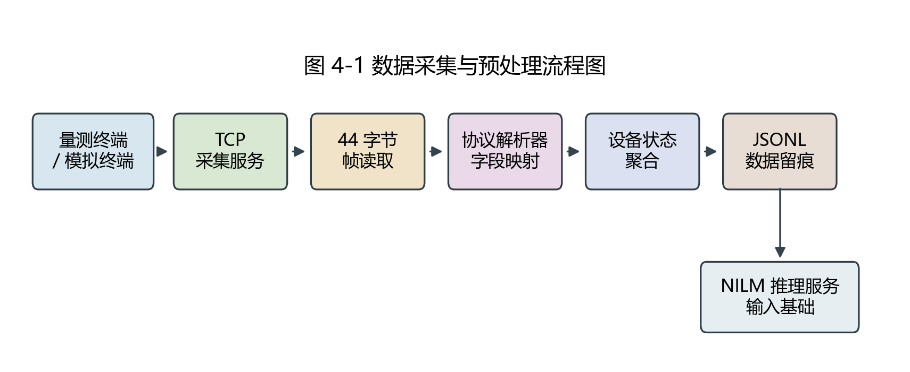
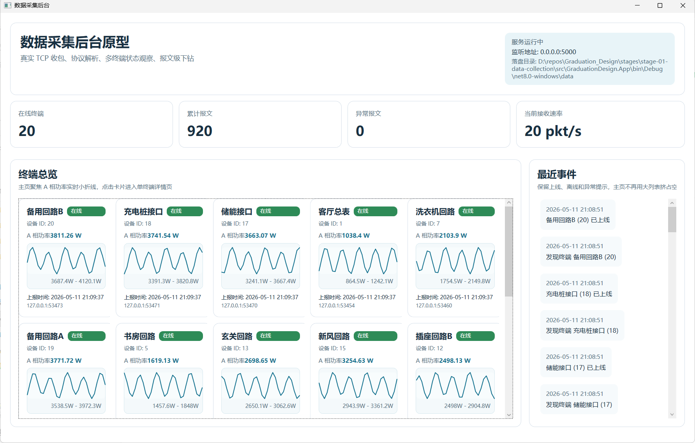
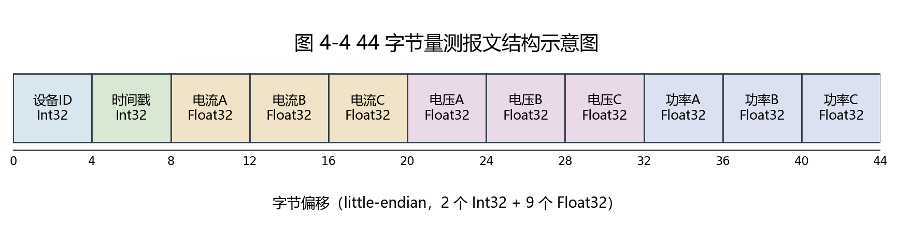
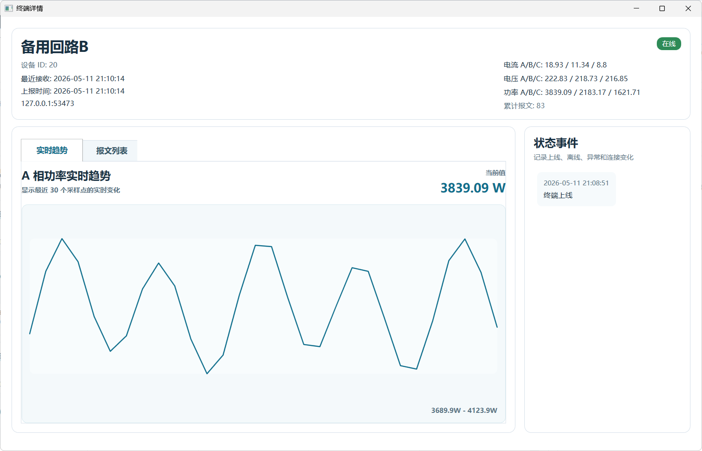
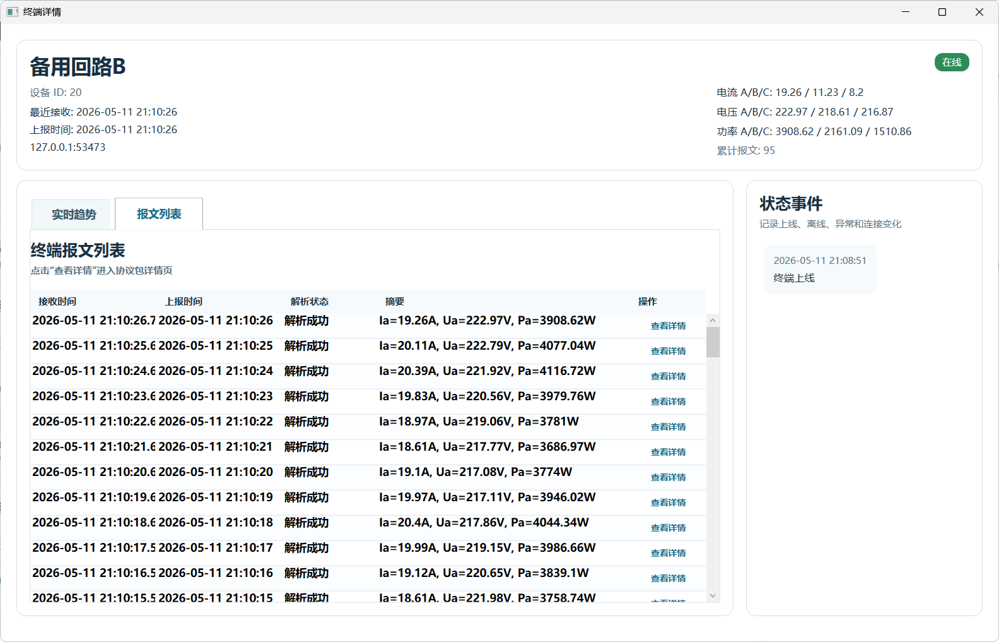
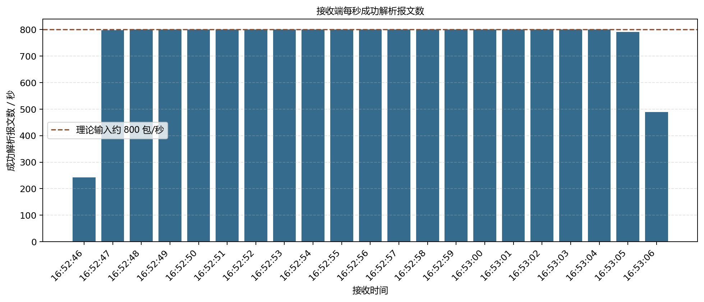

# 第4章 数据采集与预处理模块设计实现

## 4.1 本章目标与模块边界

第3章已经将系统划分为数据采集层、NILM 推理服务层和应用展示层。本章围绕其中的数据采集层展开，重点说明系统如何接收终端上报的量测数据，如何按照协议将二进制报文解析为结构化字段，以及如何通过持久化记录方式为后续推理服务提供输入基础。对于 NILM 在线监测系统而言，模型推理效果不仅取决于模型本身，也取决于前端采集链路能否稳定地产生格式一致、时间可追溯、状态可检查的数据记录。因此，数据采集与预处理模块是后续推理服务和测试分析的前置基础。

本章所称“预处理”主要指采集层内部完成的协议解析、字段结构化、时间戳处理、设备标识映射和记录留痕，不展开复杂的数据清洗、特征工程或模型输入窗口构造。滑动窗口、归一化、模型包加载、离线区间推理和在线会话推理属于第5章内容；模型指标、端到端测试和结果讨论属于第7章内容。通过这种边界划分，本章集中回答一个问题：接收端能否把终端或模拟终端上报的字节流转换为后续系统可使用的结构化量测记录。

本章实现证据主要来自 Stage-01 数据采集后台。该阶段包含 WPF 采集后台、TCP 采集服务、协议解析器、JSONL 存储模块和模拟终端工具。为体现接收端处理能力，本章除说明常规采集链路外，还补充了本机压力联调结果，用于观察接收端在多连接和较高频率模拟输入下的接收、解析和落盘情况。该压力联调用于验证接收端处理链路，不等同于真实网络环境或真实硬件终端实测。

## 4.2 数据采集与预处理总体流程

数据采集模块的总体流程如图4-1所示。终端或模拟终端首先通过 TCP 连接接入采集服务，采集服务按协议长度读取完整报文，并将得到的 44 字节二进制帧交由协议解析器处理。协议解析器按照固定字段偏移读取设备编号、上报时间、电流、电压和功率等字段，生成统一的量测记录对象。随后系统根据设备编号更新设备当前状态和最新报文列表，并将记录追加写入 JSONL 文件。后续 NILM 推理服务可以基于这些结构化记录读取时间序列输入。



图4-1中的流程体现了采集层的三个关键职责。第一，接收端需要屏蔽 TCP 字节流的连接细节，为上层提供完整报文。TCP 面向连接和字节流传输，应用层仍需要自行确定一帧报文的边界。本文系统采用固定长度报文，因此接收端以 44 字节为一帧进行读取。第二，协议解析器需要把二进制报文转换为具有业务含义的字段，使后续设备状态聚合和页面展示不再直接依赖原始字节数组。第三，数据存储模块需要同时保存解析结果和原始报文信息，使后续调试、测试和论文结果分析可以回溯到具体输入。

与直接把采集值写入数据库相比，当前阶段采用文件追加方式保存 JSONL 记录。这样做的原因是，毕业设计原型阶段更关注采集链路是否可复现、记录是否易检查、数据是否便于后续脚本处理。JSONL 每行是一条独立 JSON 记录，适合持续追加写入，也便于后续按时间范围逐行读取或统计检查。因此，该方案在实现复杂度和可追溯性之间取得了较好的平衡。

采集后台运行总览如图4-2所示。在常规模拟联调过程中，系统显示 20 个终端在线，累计报文持续增长，异常报文数量为 0，当前接收速率约为 20 帧/秒。该页面同时展示监听地址、落盘目录、终端总览和最近事件，能够从界面层面观察采集服务、模拟终端连接和设备状态聚合是否正常工作。



## 4.3 TCP 数据采集服务设计与实现

采集服务的核心实现位于 `TcpMeasurementServer`。服务启动时根据配置文件中的监听地址和端口创建 `TcpListener`，默认监听端口为 5000。当服务启动后，接收循环持续等待客户端连接。每当新的终端连接建立后，系统为该连接启动独立的异步处理流程，从而支持多个终端同时上报数据。

在连接处理过程中，接收端不会把任意一次 `ReadAsync` 返回的数据直接视为完整报文，而是通过固定缓冲区循环读取，直到累计接收到 44 字节为止。这一点对 TCP 字节流处理很重要。由于 TCP 只保证字节按顺序到达，不保证一次读取刚好对应一条业务报文，如果应用层不进行帧边界处理，就可能出现半包或粘包导致的解析错误。本文系统使用 `ReadFrameAsync` 方法按固定长度拼接完整帧，避免协议解析器处理长度不确定的数据。

当连接在未收到任何字节时关闭，接收端认为该连接正常结束，不生成量测记录。当连接关闭前已经收到部分字节但不足 44 字节时，系统将其记录为残缺报文。对于 IO 异常、Socket 异常或其他连接处理异常，接收端会生成传输异常记录。这些设计不是为了完成复杂网络可靠性测试，而是为了使接收端在遇到边界输入时能够保留状态信息，不让异常直接中断整个采集服务。

采集服务解析出的记录通过事件形式向上层发布。主视图模型订阅接收事件后，负责补充设备名称、写入存储模块、更新统计计数和设备列表。这样，TCP 接入逻辑、协议解析逻辑、存储逻辑和界面状态组织之间保持了相对清晰的职责划分。采集服务只关心连接和报文读取，协议解析器只关心字段转换，存储模块只关心记录落盘，上层视图模型再负责把记录转化为界面状态。

## 4.4 量测报文协议解析

当前量测上报协议采用 44 字节定长二进制结构，字节序为 little-endian。协议字段由 2 个 Int32 和 9 个 Float32 组成。前 4 字节为设备 ID，用于区分不同终端；第 4 到第 7 字节为上报时间戳；后续字段依次表示三相电流、三相电压和三相功率。当前协议中的上报时间采用 Unix 秒级时间戳，解析后按 UTC 时间转换为 `reportTimeUtc` 字段；平台接收时间 `receivedAt` 表示采集端收到报文的时间。二者分别用于终端量测时间序列构造和接收端运行状态统计。协议字段结构如表4-1所示。

表4-1 量测上报报文字段结构

| 偏移 | 长度 | 类型 | 字段 | 说明 |
| --- | --- | --- | --- | --- |
| 0 | 4 | Int32 | 设备 ID | 用于区分上报终端 |
| 4 | 4 | Int32 | 上报时间 | Unix 时间戳 |
| 8 | 4 | Float32 | 电流 A | A 相电流 |
| 12 | 4 | Float32 | 电流 B | B 相电流 |
| 16 | 4 | Float32 | 电流 C | C 相电流 |
| 20 | 4 | Float32 | 电压 A | A 相电压 |
| 24 | 4 | Float32 | 电压 B | B 相电压 |
| 28 | 4 | Float32 | 电压 C | C 相电压 |
| 32 | 4 | Float32 | 功率 A | A 相功率 |
| 36 | 4 | Float32 | 功率 B | B 相功率 |
| 40 | 4 | Float32 | 功率 C | C 相功率 |

报文结构也可以表示为图4-3。该图用于直观展示 44 字节数据帧与字段偏移之间的对应关系，正文解析仍以表4-1为准。



协议解析器首先检查报文长度是否等于 44 字节。如果长度不匹配，则生成残缺帧记录；如果长度正确，则按字段偏移依次读取各字段。Int32 字段使用 little-endian 方式读取，Float32 字段通过读取 32 位整数位模式并转换为单精度浮点数得到。解析成功后，系统生成 `MeasurementRecord`，其中包含接收时间、来源连接、设备编号、上报时间、电流、电压、功率、解析状态和原始报文十六进制表示。当前原型采用 Int32 秒级时间戳，满足本阶段模拟联调需要；后续真实部署时可扩展为 Int64 毫秒级时间戳，以提高时间精度和长期兼容性。

除结构化字段外，解析器还生成字段级解析信息。每个字段记录字段名称、数据类型、偏移、长度、原始十六进制和解析值。这些字段级信息可以用于协议包详情页展示，也有助于调试协议映射是否正确。与只保留最终数值相比，同时保留原始字节和解析映射能够增强系统可追溯性。当后续发现某条记录异常时，可以从结构化值回溯到原始报文字节，判断问题来自终端上报、网络传输还是解析逻辑。

## 4.5 设备状态聚合与边界情况处理设计

协议解析后的记录需要进一步按设备维度聚合。系统使用设备 ID 作为聚合键，并通过配置文件中的 `Devices` 节点将设备 ID 映射为可读设备名称。例如，1 号设备映射为“客厅总表”，2 号设备映射为“空调回路”。如果设备 ID 没有配置名称，系统可以使用回退名称，以保证未知设备也能在记录中被标识出来。

主视图模型收到采集记录后，会先补充设备名称，再尝试写入 JSONL 存储。如果记录写入成功，则继续更新全局统计、最新报文列表和设备状态；如果写入失败，则将记录状态标记为存储异常。对于解析成功的记录，设备视图模型会更新该设备的最新上报时间、最近连接地址、三相电流、三相电压和三相功率等信息。对于解析失败或连接异常类记录，系统不会把它当作正常量测值更新，但会保留异常状态和错误信息。

单终端状态聚合效果如图4-4所示。设备详情页显示设备 ID、最近接收时间、上报时间、连接来源、在线状态、三相电流、三相电压、三相功率和累计报文数量，并以最近采样点绘制 A 相功率实时趋势。该界面说明采集端不仅保存单条报文，也会将连续报文聚合为面向设备的当前状态和短期趋势。



本文系统在采集端考虑了若干边界情况，主要目的是避免边界输入导致接收端整体中断，并使异常能够被记录和展示。表4-2给出当前状态类型及其含义。

表4-2 接收记录状态类型说明

| 状态 | 中文展示 | 含义 | 处理目的 |
| --- | --- | --- | --- |
| `Success` | 解析成功 | 收到完整 44 字节报文并成功解析 | 参与设备状态更新和数据留痕 |
| `PartialFrame` | 残缺报文 | 连接关闭前收到不足 44 字节数据 | 保留半包信息，便于定位输入异常 |
| `ParseError` | 解析失败 | 报文长度正确但字段解析过程异常 | 保留错误原因和原始报文 |
| `TransportError` | 连接异常 | 连接处理过程中发生 IO 或 Socket 异常 | 避免连接异常中断接收服务 |
| `StorageError` | 存储异常 | 记录写入 JSONL 时发生异常 | 将存储问题显式暴露给上层 |

需要说明的是，本章不把这些边界情况处理写成完整网络可靠性测试。由于当前联调主要在同一台机器上完成，本章更适合表述为“接收端对残缺输入、解析异常、传输异常和存储异常设计了状态记录机制”。真实网络延迟、跨主机链路、丢包和带宽限制等内容不作为本章测试结论。

在当前定长协议下，只要报文长度正确，Int32 和 Float32 字段通常都可以被解析为某个数值，因此 `ParseError` 的触发场景相对较少。该状态主要用于保留字段读取过程中的异常。对于 NaN、Infinity 或明显超出物理合理范围的数值，后续可扩展字段合法性校验状态，以进一步区分“格式可解析但数值异常”的输入。

## 4.6 数据落盘与 JSONL 记录结构

采集模块采用 JSON Lines 作为第一阶段的持久化格式。JSONL 文件每行保存一条独立记录，便于在接收过程中持续追加，也便于后续用脚本按行读取、筛选和统计。存储模块根据配置文件中的存储目录和文件名模式生成落盘路径，例如 `measurements-20260511.jsonl`。每收到一条记录后，系统将其序列化为一行 JSON 并追加到当天文件中。

由于接收端支持多个客户端连接同时上报，文件追加过程需要避免并发写入造成行内容交错。存储模块在写入 JSONL 时使用串行化写入路径，通过写入门控对象保护文件追加过程，使同一时刻只有一条记录进入实际写文件操作。这样可以保证每条 JSON 记录独占一行，便于后续按行读取、统计和异常定位。

JSONL 记录的主要字段如表4-3所示。

表4-3 JSONL 记录字段说明

| 字段 | 含义 | 用途 |
| --- | --- | --- |
| `receivedAt` | 平台接收时间 | 用于接收端时间排序和联调统计 |
| `remoteEndPoint` | TCP 来源连接 | 用于定位来源连接 |
| `deviceId` | 设备编号 | 用于设备聚合 |
| `deviceName` | 设备名称 | 用于界面展示和人工识别 |
| `reportTimeUtc` | 终端上报时间 | 用于构造量测时间序列 |
| `currentA`、`currentB`、`currentC` | 三相电流 | 保存解析后的电流字段 |
| `voltageA`、`voltageB`、`voltageC` | 三相电压 | 保存解析后的电压字段 |
| `powerA`、`powerB`、`powerC` | 三相功率 | 保存解析后的功率字段 |
| `parseStatus` | 解析状态 | 用于区分正常记录和异常记录 |
| `errorMessage` | 异常说明 | 用于异常定位 |
| `rawHex` | 原始报文十六进制 | 用于协议追溯和调试 |

以下为本章联调过程中抽取的一条 JSONL 记录片段。该记录来自模拟终端联调，用于说明落盘结构，不作为真实家庭用电数据。完整记录保存在第4章证据目录中，正文仅列出关键字段以避免长行影响版式。

```json
{
  "receivedAt": "2026-05-11T08:32:39.5847902Z",
  "deviceId": 3,
  "deviceName": "厨房回路",
  "reportTimeUtc": "2026-05-11T08:32:39Z",
  "powerA": 1343.5183,
  "powerB": 767.1592,
  "powerC": 513.34766,
  "parseStatus": "Success",
  "rawHex": "03 00 00 00 ..."
}
```

从该记录可以看出，系统既保存了面向业务处理的结构化字段，也保存了原始报文 `rawHex`。这种设计使采集层输出不仅能被后续推理服务读取，也能被测试脚本和人工审查直接检查。对于毕业设计阶段的系统实现而言，这种轻量、可检查的留痕方式比直接引入复杂数据库更适合前期验证。

设备详情页中的报文列表如图4-5所示。列表按接收时间展示单终端最近报文，包含接收时间、上报时间、解析状态、关键字段摘要和详情入口。该界面与 JSONL 落盘记录对应，便于在联调过程中直接检查某个设备的连续报文是否按预期解析。



## 4.7 模拟终端与接收端运行表现

在缺少真实硬件终端的情况下，本文使用模拟终端工具完成采集模块联调。模拟终端读取后台配置文件，获得目标监听地址、端口和设备名称。设备 ID 可以通过显式列表或范围配置，当前配置默认启用 1-20 号设备。每个模拟终端按设定间隔生成一条 44 字节二进制报文，并写入 TCP 连接；当连接失败或中断时，模拟终端会按重连间隔尝试重新连接。

常规联调中，采集 App 监听 `0.0.0.0:5000`，模拟终端连接 `127.0.0.1:5000`，共启用 20 个设备。运行日志显示，20 个模拟终端均成功连接，并在 10 秒时每个终端累计发送 10 条报文；本次联调窗口持续到约 15 秒，从落盘文件统计得到记录 320 条，其中成功解析记录 300 条，停止联调时产生连接异常记录 20 条。该组数据表示在本次常规联调窗口内，每个设备平均形成约 15 条成功解析记录。该结果说明常规多设备联调下，接收、解析和落盘链路能够形成可检查记录。

为了更直接体现接收端处理能力，本章补充了一次本机压力联调。压力发送脚本模拟 80 个连接，持续 20 秒，每个连接每 100 ms 发送一条 44 字节报文，理论输入速率约为 800 帧/秒。发送端实际发送 15920 条报文，连接错误为 0。接收端从落盘文件中统计得到 15920 条记录，其中成功解析记录 15920 条，状态分布为 `Success=15920`。压力联调结果如表4-4所示。

表4-4 接收端压力联调结果

| 指标 | 结果 |
| --- | --- |
| 模拟连接数 | 80 |
| 持续时间 | 20 秒 |
| 单连接发送间隔 | 100 ms |
| 理论输入速率 | 约 800 帧/秒 |
| 发送端实际发送 | 15920 条报文 |
| 发送端连接错误 | 0 |
| 接收端落盘记录 | 15920 条 |
| 成功解析记录 | 15920 条 |
| 本机联调成功解析比例 | 15920/15920 |
| 按秒统计最高成功解析吞吐 | 约 800 帧/秒 |
| 单设备成功解析记录数范围 | 199-199 |

图4-6展示了压力联调期间接收端每秒成功解析报文数。可以看到，在主要压力输入阶段，接收端按秒统计的成功解析数量接近理论输入速率。开始和结束时的柱形较低，主要与压力脚本启动、连接建立和运行窗口截取有关。



从落盘文件按设备编号统计，80 个模拟设备均成功解析 199 条记录，未出现设备维度上的接收数量不均衡。压力发送端发送量与接收端成功解析量也均为 15920 条，说明在本次本机模拟输入条件下，接收端对符合协议格式的定长报文实现了完整接收、解析和落盘。

上述压力联调在同一台机器上完成，不能等同于真实网络环境测试。它主要用于说明接收端代码路径在多连接和较高频率模拟输入下具备接收、解析和落盘能力。网络延迟、跨主机带宽、真实硬件采样误差和长期运行稳定性等因素仍需在更接近实际部署的环境中进一步验证。对于本章目标而言，该结果可以支撑“接收端在本机模拟条件下具备基本并发接入和较高频率报文处理能力”的结论。

## 4.8 本章小结

本章围绕数据采集与预处理模块，说明了采集层从 TCP 连接接入、固定长度报文读取、协议字段解析、设备状态聚合到 JSONL 持久化记录的实现过程。接收端通过 44 字节定长协议将二进制量测报文转换为结构化记录，并同时保留原始报文十六进制内容和解析状态，从而为后续推理服务和测试分析提供可追溯输入。

在联调验证方面，本章使用模拟终端完成了常规多设备接入，并通过本机压力发送脚本观察接收端在多连接和较高频率模拟输入下的处理表现。压力联调结果显示，在 80 个模拟连接、约 800 帧/秒输入条件下，接收端成功解析并落盘 15920 条记录。该结果说明本文采集模块在毕业设计原型范围内具备数据接入、协议解析和持久化记录能力。下一章将在本章结构化采集记录基础上，进一步说明 NILM 推理服务模块如何加载模型包、执行离线推理和在线会话推理。
